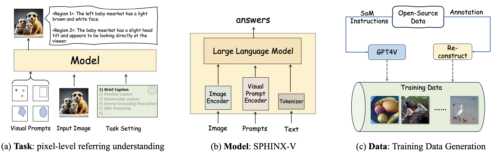
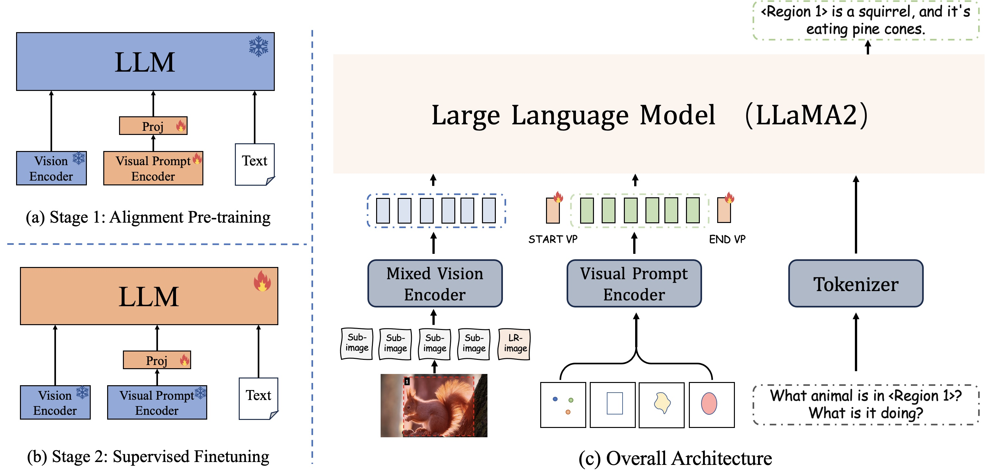
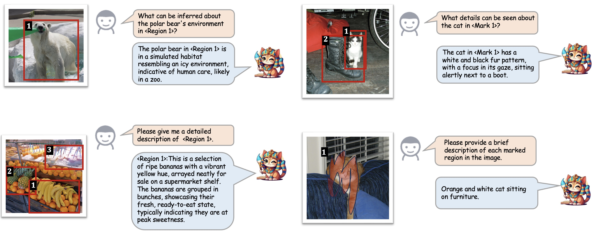
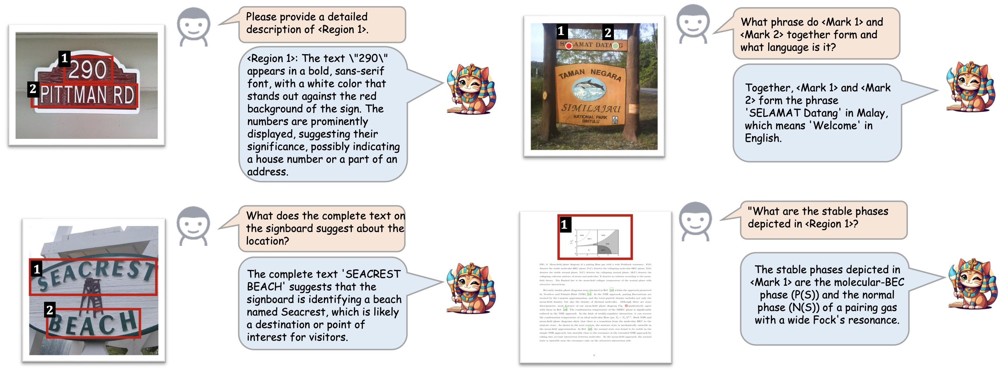
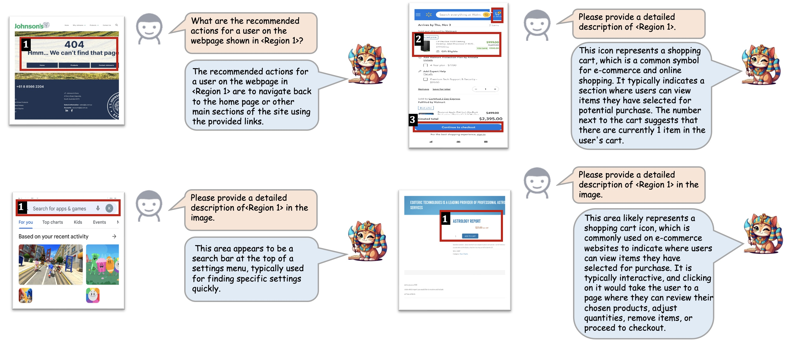
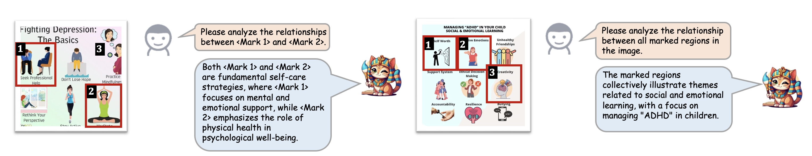
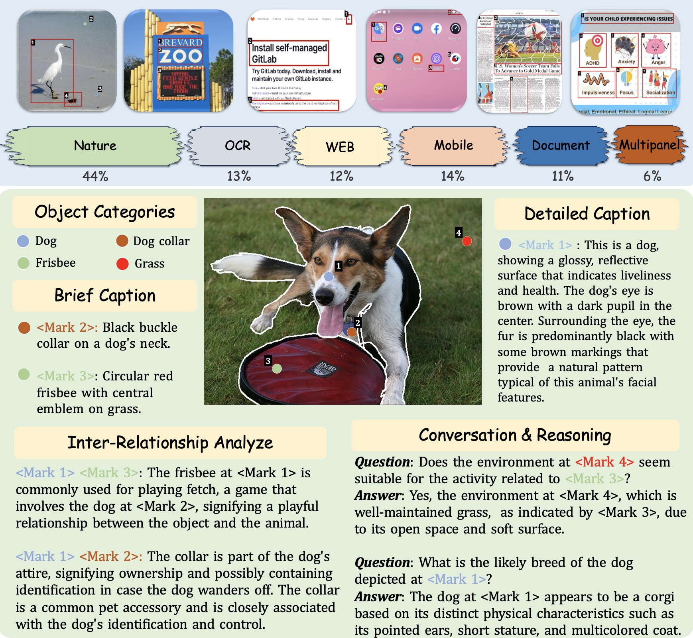

<div align="center">
    
    
</div>


<div align="center">

## 🎨 Draw-and-Understand: Leveraging Visual Prompts to Enable MLLMs to Comprehend What You Want

[Weifeng Lin](), [Xinyu Wei](), [Ruichuan An](), [Peng Gao]()

[Bocheng Zou](), [Yulin Luo](), [Siyuan Huang](), [Shanghang Zhang]() and [Hongsheng Li]()

</div>

<div align="center">

[](https://draw-and-understand.github.io/) [](https://arxiv.org/abs/2403.20271) [](http://106.14.2.150:10020/) [](https://github.com/AFeng-x/Draw-and-Understand/blob/main/LICENSE)

[[🌐 Project Page](https://draw-and-understand.github.io/)] [[📖 Paper](https://arxiv.org/abs/2403.20271)] [[🤗 MDVP-Data](https://huggingface.co/datasets/Afeng-x/Draw-and-Understand/tree/main/stage_2_fine-tuning/MDVP-Data)] [[🤗 MDVP-Bench](https://huggingface.co/datasets/Afeng-x/Draw-and-Understand/tree/main/MDVP-bench)] [[🤖️ Model](https://huggingface.co/Afeng-x/SPHINX-V-Model)] [[🎮 Demo](http://106.14.2.150:10020/)]

</div>

## 💥 News

- **[2024.03.28]** 🔥 We released the [MDVP-Data](https://huggingface.co/datasets/Afeng-x/Draw-and-Understand/tree/main/stage_2_fine-tuning/MDVP-Data) dataset and [MDVP-Bench](https://huggingface.co/datasets/Afeng-x/Draw-and-Understand/tree/main/MDVP-bench) benchmark.

- **[2024.03.28]** 🔥 We released the [SPHINX-V-13B model](https://huggingface.co/Afeng-x/SPHINX-V-Model) and [online demo](http://106.14.2.150:10020/).

- **[2024.03.28]** 🚀 We release the [arXiv paper](https://arxiv.org/abs/2403.20271).

- **[2024.03.28]** 🚀 We released the traning and [evaluation](accessory/eval/readme.md) code.


<!-- ## 💪 ToDo

- - [x] Coming soon: 

- &nbsp;&nbsp;✅ Coming soon:  -->


## 👀 Introduction

The interaction between humans and artificial intelligence (AI) is a crucial factor that reflects the effectiveness of multimodal large language models (MLLMs). However, current MLLMs primarily focus on image-level comprehension and limit interaction to textual instructions, thereby constraining their flexibility in usage and depth of response. Therefore, we introduce the **Draw-and-Understand project**: a new model, a multi-domain dataset, and a challenging benchmark for visual prompting.

<p align="center">
     <br>
</p>

Specifically, the model is named **SPHINX-V**, a new multimodal large language model designed for visual prompting, equipped with a novel visual prompt encoder and a two-stage training strategy. SPHINX-V supports multiple visual prompts simultaneously across various types, significantly enhancing user flexibility and achieve a fine-grained and open-world understanding of visual prompts.

<p align="center">
     <br>
</p>


## 🚀 Examples Show

<details>
<summary>🔍 Natural Image Domain</summary>

<p align="center">
     <br>
</p>
</details>

<details>
<summary>🔍 OCR Image Domain</summary>

<p align="center">
     <br>
</p>
</details>

<details>
<summary>🔍 Mobile/Website Screenshot Domain</summary>

<p align="center">
     <br>
</p>
</details>

<details>
<summary>🔍 Multi-panel Image Domain</summary>

<p align="center">
     <br>
</p>
</details>


## 🛠️ Install 

1. Clone this repository and navigate to Draw-and-Understand folder
``` bash
git clone https://github.com/AFeng-x/Draw-and-Understand.git
cd Draw-and-Understand
```
2. Install packages
``` bash
# Create a new conda environment named 'sphinx-v' with Python 3.10
conda create -n sphinx-v python=3.10 -y
# Activate the 'sphinx-v' environment
conda activate sphinx-v
# Install required packages from 'requirements.txt'
pip install -r requirements.txt
```
3. Optional: Install Flash-Attention
``` bash
# Draw-and-Understand is powered by flash-attention for efficient attention computation.
pip install flash-attn --no-build-isolation
```
4. Install Draw-and-Understand as Python Packege
``` bash
# go to the root directory of Draw-and-Understand
cd Draw-and-Understand
# install Draw-and-Understand
pip install -e .
# After this, you will be able to invoke “import SPHINX_V” without the restriction of working directory.
```
5. To enable the segmentation ability shown in our official demo, SAM is also needed:
``` bash
pip install git+https://github.com/facebookresearch/segment-anything.git
```


## 🤖️ Checkpoints

SPHINX-V-13b Stage-1 Pre-training Weight: 🤗[Hugging Face](https://huggingface.co/Afeng-x/SPHINX-V-Model/tree/main/sphinx-v/stage1) / [Baidu](https://pan.baidu.com/s/1VRSHyKrnyyvdJq-I_r85Vg?pwd=i9f5)

SPHINX-V-13b Stage-2 Fine-tunings Weight: 🤗[Hugging Face](https://huggingface.co/Afeng-x/SPHINX-V-Model/tree/main/sphinx-v/stage2) / [Baidu](https://pan.baidu.com/s/1VRSHyKrnyyvdJq-I_r85Vg?pwd=i9f5)

Other required weights and configurations: 🤗[Hugging Face](https://huggingface.co/Afeng-x/SPHINX-V-Model/tree/main)

Please download them to your own machine. The file structure should appear as follows:
```
accessory/checkpoints/sphinx-v/stage2
├── consolidated.00-of-02.model.pth
├── consolidated.01-of-02.model.pth
├── tokenizer.model
├── config.json
└── meta.json
```
```
accessory/checkpoints/llama-2-13b
├── params.json

accessory/checkpoints/tokenizer
├── tokenizer.model
```


## 📁 MDVP-Dataset

- MDVP-Data is a comprehensive dataset for multi-domain visual-prompt instruction tuning. This dataset encompasses data for both point-level and region-level understanding, designed to enhance a model’s comprehension ability and robustness.

- Based on MDVP-Data, we also introduce MDVP-Bench, a challenging benchmark designed to evaluate tasks that require a combination of detailed description referrals, inter-relationship analysis, and complex reasoning.

<p align="center">
     <br>
</p>


## 🚀 Training 

- **Prepare data**
  - Please download the annotations of our pre-training data and images. (Refer to the [Dataset Preparation](Data/dataset.md))

- **Stage 1: Image-Visual Prompt-Text Alignment Pre-training**
  - Download the pretrained SPHINX-v2-1k Weights from [Hugging face](https://huggingface.co/Alpha-VLLM/LLaMA2-Accessory/tree/main/finetune/mm/SPHINX/SPHINX-v2-1k) or [Baidu](https://pan.baidu.com/s/1PKCf515EGmSnSZ8teERHjQ?pwd=88z0)(88z0). Place the model in the "accessory/checkpoints/sphinx-v2-1k" directory.
  - Download the [ViT-H SAM model](https://dl.fbaipublicfiles.com/segment_anything/sam_vit_h_4b8939.pth) and place the model in the "accessory/checkpoints/sam" directory.
  - Pre-training configuration is [vp_pretrain.yaml](./accessory/configs/data/vp_pretrain.yaml). Please ensure that all annotations are included and update the image paths in each JSON file to reflect the paths on your machine.
  - Update the model paths in the run script.
  - Run `bash scripts/train_sphinx-v_pretrain_stage1.sh`.

- **Stage 2: Multi-Task End-to-End Supervised Finetuning**
  - Download SPHINX-V Stage-1 Pre-training Weights from [🤖️Checkpoints](https://github.com/AFeng-x/Draw-and-Understand?tab=readme-ov-file#%EF%B8%8F-checkpoints). Alternatively, you may use your own model weights trained from Stage 1.
  - Place the model in the "accessory/checkpoints/sphinx-v/stage1" directory.
  - Fine-tuning configuration is [vp_finetune.yaml](./accessory/configs/data/vp_finetune.yaml). Please ensure that all annotations are included and update the image paths in each JSON file to reflect the paths on your machine.
  - Update the model paths in the run script.
  - Run `bash scripts/train_sphinx-v_finetune_stage2.sh`.


## 📈 Evaluation 
See [evaluation](./accessory/eval/readme.md) for details.


## 🛩️ Inference
We provide a simple example for inference in [inference.py](./SPHINX_V/inference.py)

You can launch this script with `torchrun --master_port=1112 --nproc_per_node=1 inference.py`


## 🪁 Host Local Demo
💻 **requirments:** 
1. For this demo, it needs to prepare the SPHINX-V stage-2 checkpoints and ViT-H SAM model, and place them in the `accessory/checkpoints/` directory.
2. Make sure you have installed Segment Anything.
3. Run.
```
cd accessory/demos
bash run.sh
```


## 💌 Acknowledgement
- [LLaMA-Accessory](https://github.com/Alpha-VLLM/LLaMA2-Accessory): the codebase we built upon.
- [SAM](https://github.com/facebookresearch/segment-anything): the demo also uses the segmentation result from SAM.


## 🖊️: Citation

If you find our **Draw-and-Understand** project useful for your research and applications, please kindly cite using this BibTeX:

```latex
@misc{lin2024drawandunderstand,
      title={Draw-and-Understand: Leveraging Visual Prompts to Enable MLLMs to Comprehend What You Want}, 
      author={Weifeng Lin and Xinyu Wei and Ruichuan An and Peng Gao and Bocheng Zou and Yulin Luo and Siyuan Huang and Shanghang Zhang and Hongsheng Li},
      year={2024},
      eprint={2403.20271},
      archivePrefix={arXiv},
      primaryClass={cs.CV}
}
```